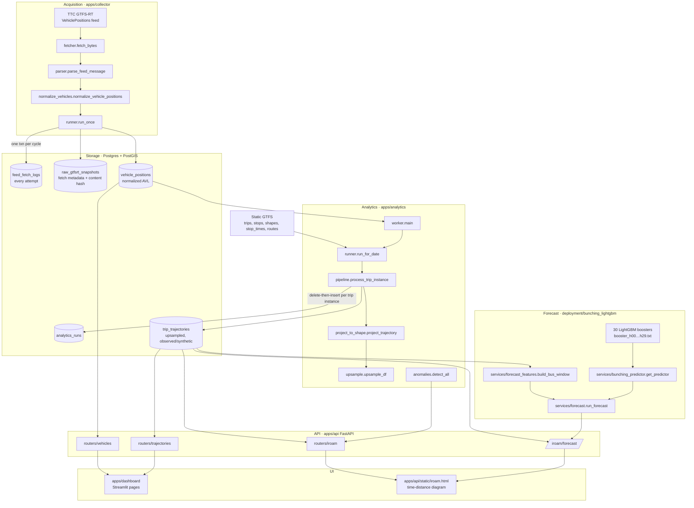
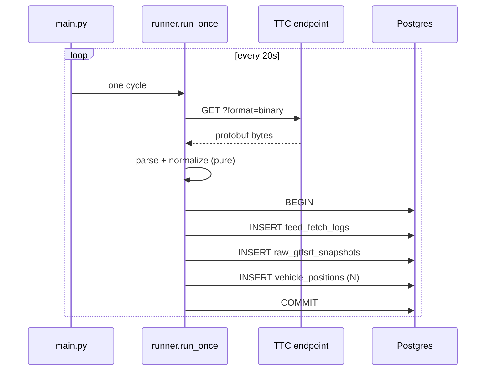
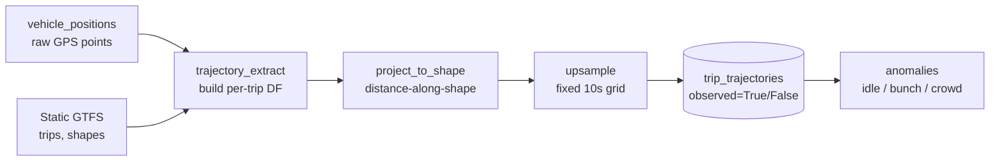
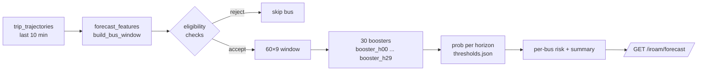

# Architecture

iROAM is a layered application. Each layer encapsulates one runtime concern and connects to its neighbours through stable data contracts. Five layers, plus a forecasting bundle that hangs off the API.

## Top-level data flow



The system separates **transaction owners** (runners) from **pure transforms** (parsers, normalizers, projectors). Every layer except the runners is side-effect free, which makes the pipeline reproducible, testable, and resilient to partial failures.

---

## Layer 1 — Acquisition

`apps/collector` polls the TTC `VehiclePositions` feed every 20 seconds (configurable), parses the protobuf payload, normalizes each `FeedEntity.vehicle`, and persists results in one atomic transaction per cycle.

Key files:

- **`fetcher.py`** — HTTP layer with retries and timing. One function, `fetch_bytes`.
- **`parser.py`** — protobuf decode with text-format fallback (the TTC endpoint occasionally drops `?format=binary`).
- **`feed_specs.py`** — registry binding feed name → URL → normalizer. Adding a future TripUpdates or Alerts feed touches only this file.
- **`normalize_vehicles.py`** — pure function: `FeedMessage → list[VehiclePosition]`. No DB calls.
- **`runner.py`** — the only DB writer. Single transaction:
  1. Always: a `feed_fetch_logs` row (success or failure).
  2. On success: a `raw_gtfsrt_snapshots` metadata row (content hash, header info).
  3. On success: N normalized `vehicle_positions` rows.
- **`main.py`** — CLI entry. `--once` for a single fetch; `--loop` for the polling daemon.



**Failure handling.** Network or 5xx errors log a `feed_fetch_logs` row with `success=false` and skip the other inserts. The FK between `raw_gtfsrt_snapshots` and its fetch log stays clean.

---

## Layer 2 — Storage

PostgreSQL 16 with PostGIS, SQLAlchemy 2.x typed-`Mapped` ORM, four Alembic migrations.

Two design policies coexist:

- **Append-only ingestion** for everything in Layer 1. "Latest" is a query (`DISTINCT ON (key) ORDER BY key, fetched_at DESC`), never a mutation. This preserves observation history at minimal cost.
- **Refresh-by-trip-instance** for the derived `trip_trajectories`. Each trip instance's rows are deleted and reinserted on every analytics tick — atomic per `(trip_id, start_date)`, enforced by a unique index.

The raw protobuf bytes are **not** persisted — migration `0005` dropped `raw_gtfsrt_snapshots.payload` (BYTEA), which had been the largest on-disk cost (~700 KB × 2 polls/min ≈ 2 GB/day). Re-normalization after a parser change replays from the decoded per-entity JSON in `vehicle_positions.raw_entity`; the snapshot row retains `content_sha256` so feed-staleness stays observable. `vehicle_positions` is now the dominant on-disk cost and the candidate for Phase-2 partitioning.

See **[Data model](data-model.html)** for tables, columns, indexes, and retention.

---

## Layer 3 — Analytics

`apps/analytics` reconstructs per-trip trajectories from `vehicle_positions` plus static GTFS.



Pipeline stages (`apps/analytics/`):

1. **`gtfs_static.load_all`** — read `Complete GTFS/*.txt` into pandas, cached per-process by directory mtime.
2. **`pipeline.list_trip_instances`** — distinct `(trip_id, effective_start_date)` for the service date, derived from `vehicle_timestamp` in Toronto local time.
3. **`trajectory_extract.build_trip_trajectory`** — fetch rows for the instance, resolve `shape_id` and `direction_id`, parse the GTFS overnight start_time (`27:15:00`).
4. **`project_to_shape.project_trajectory`** — re-project to EPSG:3857, compute `travel_distance_m` along the shape and `orthogonal_distance_m` to it; drop outliers > 200 m.
5. **`upsample.compute_moving_speed` + `upsample_df`** — finite-difference speed, then upsample to a 10-second grid. Synthetic rows are flagged `observed=False`.
6. **`anomalies.detect_all`** — pure detectors over the upsampled trajectory:
   - **idle**: speed ≤ 0.5 m/s for ≥ `idle_min`.
   - **crowd**: OccupancyStatus mapped to a percentage, ≥ `crowd_pct`.
   - **bunch (time)**: two consecutive buses cross the same stop within `bunch_seconds`.
   - **bunch (distance)**: two consecutive buses maintain a route-distance separation below `bunch_distance_m`.

Anomaly thresholds are query parameters, not table columns. The detectors re-run client-side on every slider change without touching the DB.

**Two run modes:**

- **`apps.analytics.main`** — one-shot batch for a `--date`, optionally `--route`. Full refresh.
- **`apps.analytics.worker`** — long-running. Every `ANALYTICS_WORKER_INTERVAL_SECONDS` (default 120 s), rebuilds only the trip instances whose underlying `vehicle_positions` rows changed since the last tick.

---

## Layer 4 — API

`apps/api` is a FastAPI app. Read-only, no auth (intended to run behind a reverse proxy). The routers organize by surface area:

| Router | Endpoints | Source data |
| --- | --- | --- |
| `health` | `GET /health` | (none) |
| `feed_status` | `GET /feed-status/vehicle-positions` | `feed_fetch_logs` |
| `vehicles` | `GET /vehicles/latest`, `…/{vehicle_id}/latest`, `…/{vehicle_id}/history` | `vehicle_positions` |
| `routes` | `GET /routes`, `…/{route_id}/vehicles/latest`, `…/{route_id}/metrics` | `vehicle_positions` |
| `replay` | `GET /replay/vehicles` | `vehicle_positions` |
| `trajectories` | `GET /trajectories/service-dates`, `…/trips`, `…/trips/{id}` | `trip_trajectories` |
| `iroam` | `GET /iroam/{routes,stops,buses,analytics,forecast}` | `trip_trajectories` + `anomalies` + predictor |

Pydantic schemas live alongside in `apps/api/schemas/`. Every endpoint depends on `apps/api/deps.get_db` for a scoped SQLAlchemy session.

---

## Layer 5 — UI

Two surfaces share the API:

- **`apps/dashboard`** — Streamlit multipage app. Home, Feed Health, Live Fleet Map, Route Explorer, Vehicle Detail, Replay, Trajectories. All data comes from the API via `apps/dashboard/api_client.py`. No direct DB reads.
- **`apps/api/static/iroam.html`** — a static HTML interface served at `/ui` for the iROAM time-distance diagram, schematic route map, and forecast panel. Hits `/iroam/buses`, `/iroam/analytics`, `/iroam/forecast`.

---

## Layer 6 — Forecast (LightGBM bunching predictor)

`deployment/bunching_lightgbm` is a self-contained model bundle. The API loads it lazily on first `/iroam/forecast` request.

**Bundle contents** (`deployment/bunching_lightgbm/model/`):

- `booster_h00.txt` … `booster_h29.txt` — 30 per-horizon LightGBM boosters (one model per future minute).
- `scaler.json` — per-channel mean/std for the 9 input channels.
- `thresholds.json` — F2-optimal decision threshold per horizon.
- `metadata.json` — training config (`seq_len=60`, `pred_len=30`, `n_channels=9`).

**Feature window** (`apps/api/services/forecast_features.py`): for each eligible running bus, build a `60 × 9` window of:

```
[target_speed, target_gap_ahead, target_aux,
 upstream1_speed, upstream1_gap, upstream1_aux,
 upstream2_speed, upstream2_gap, upstream2_aux]
```

at 10-second steps over the past 10 minutes. Eligibility checks: fresh sample (≤ 90 s old), not near route ends, contiguous history with gaps ≤ 20 s, all values finite.

**Inference** (`apps/api/services/forecast.py`): batch eligible windows through all 30 boosters, return per-bus probabilities and a horizon summary.



---

## Key engineering decisions

1. **Append-only schema.** "Latest" is a query, not an upsert. Upgradable to a materialized view without an API change.
2. **Raw + normalized dual storage.** Future parser bugs can be fixed and replayed without touching the live feed.
3. **Pure transforms + narrow transaction boundaries.** Normalizers, projectors, and detectors have no DB side effects; only `runner.py` modules write.
4. **Sync SQLAlchemy.** At ~2 polls/min and low-QPS internal API, async adds transaction complexity for no latency benefit.
5. **TIMESTAMPTZ everywhere.** UTC at rest; only display layers convert to `America/Toronto`.
6. **Streamlit → API → DB.** Never Streamlit → DB. A future React rewrite is a UI swap, not a data-layer change.
7. **Threshold sliders are query params, not stored data.** Anomaly detectors re-run on the API instance per request; the heavy data (upsampled trajectories) is pre-computed.
8. **Lazy model loading.** The LightGBM bundle loads on first forecast request, not at startup. The API stays cheap when forecasting is unused.
