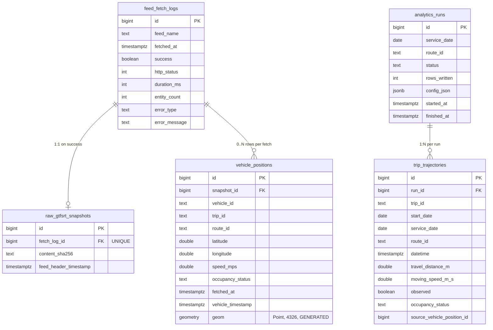

# Data model

Five tables across two ingestion policies. PostgreSQL 16 + PostGIS, all timestamps `TIMESTAMPTZ` in UTC. Defined by SQLAlchemy 2.x typed-`Mapped` models under `db/models/` and migrated via Alembic (`db/migrations/versions/`).

## Schema overview

## Tables

| Table | Source | Policy | Hottest read pattern |
| --- | --- | --- | --- |
| `feed_fetch_logs` | every fetch, success or failure | append-only | recent-minute success rate |
| `raw_gtfsrt_snapshots` | one row per successful fetch | append-only | FK link target (write-only) |
| `vehicle_positions` | one row per `FeedEntity.vehicle` per fetch | append-only | `DISTINCT ON (vehicle_id)` latest |
| `analytics_runs` | one row per analytics invocation or worker tick | append-only | run history |
| `trip_trajectories` | upsampled trajectory points | **delete-then-insert per trip instance** | route × date × direction slice |

### `feed_fetch_logs`

Every collector cycle writes one row, even when the network call failed. This is the monitoring signal: "the feed is reachable" vs. "the feed went silent." Driven by `apps/collector/runner.run_once`.

### `raw_gtfsrt_snapshots`

One metadata row per successful fetch: `content_sha256`, the feed-header timestamp, and the protobuf version/incrementality. Its job is to be the link target for `vehicle_positions.snapshot_id` and to record the feed-content hash.

The raw protobuf bytes are **not** stored (dropped in migration `0005`). They were the dominant on-disk cost (~700 KB/row, ~2 GB/day) and bought only byte-identical raw replay, which was never wired up. Re-normalization now relies on the decoded per-entity JSON kept in `vehicle_positions.raw_entity`; fetch metadata lives in `feed_fetch_logs`. The `content_sha256` is retained so the operational signal "feed reachable but stale" (identical hash across consecutive polls) stays observable without keeping the payload.

### `vehicle_positions`

Normalized form of the raw payload, one row per `FeedEntity.vehicle` per snapshot. Columns mirror the GTFS-RT vehicle message plus a PostGIS `geom(Point, 4326)` **generated** column for spatial queries.

Why `fetched_at` is denormalized onto this table: the hottest query is `DISTINCT ON (vehicle_id) ORDER BY vehicle_id, fetched_at DESC`. Joining back to `raw_gtfsrt_snapshots` for that timestamp would destroy the composite index. Both tables are append-only, so the denormalized value cannot drift.

**Indexes:**

- `(vehicle_id, fetched_at DESC)` — per-vehicle latest
- `(route_id, fetched_at DESC)` — per-route latest
- `(trip_id, fetched_at DESC)` — per-trip history
- GiST on `geom` — future spatial joins

### `analytics_runs`

One row per `apps.analytics.main` invocation or worker tick. Tracks `status`, `rows_written`, `started_at`, `finished_at`, and the config used for the run. Source of truth for "was today's analytics ever computed."

### `trip_trajectories`

The derived product. Each row is a point on an upsampled trajectory for a `(trip_id, start_date)` pair: `datetime`, `travel_distance_m`, `moving_speed_m_s`, `observed` (True for real GPS samples, False for synthetic grid points).

The unique index `(trip_id, start_date, datetime)` enforces that re-running the analytics for a trip instance produces no duplicates. The worker rebuilds an instance by deleting its rows and reinserting — atomic in one transaction.

## Migrations

Five Alembic migrations under `db/migrations/versions/`:

1. `0001_initial_schema.py` — `feed_fetch_logs`, `raw_gtfsrt_snapshots`.
2. `0002_pivot_to_vehicle_positions.py` — replaced the original `trip_updates` pivot with `vehicle_positions`.
3. `0003_trip_trajectories.py` — analytics output tables.
4. `0004_trip_trajectory_unique.py` — adds the `(trip_id, start_date, datetime)` unique index. The migration guards against existing duplicates; run `make db-reset-confirm` first if needed.
5. `0005_drop_snapshot_payload.py` — drops `raw_gtfsrt_snapshots.payload`; the raw protobuf bytes are no longer stored.

## Retention

No retention policy is enforced today; everything is append-only and growing. With the raw payload dropped (migration `0005`), the dominant cost is now `vehicle_positions` — chiefly its `raw_entity` JSONB column. Phase-2 partitioning (declarative monthly partitions on `vehicle_positions`) is sketched in the migrations plan but not yet implemented.

## Static GTFS inputs

The analytics layer joins live AVL against the TTC's static GTFS feed, mounted read-only at `/gtfs` in the `api` and `analytics-worker` containers (host path: `./Complete GTFS/`). Files consumed:

| File | Loaded by | Used for |
| --- | --- | --- |
| `agency.txt` | (reference only) | — |
| `routes.txt` | `apps/analytics/gtfs_static.load_all` | route metadata, direction labels |
| `trips.txt` | `apps/analytics/gtfs_static.load_all` | `trip_id → shape_id, direction_id` |
| `shapes.txt` | `apps/analytics/shapes.build_linestrings` | per-shape `LineString` for GPS projection |
| `stops.txt` | `apps/analytics/stop_projection.compute_route_stops` | stop locations |
| `stop_times.txt` | `apps/analytics/gtfs_static.load_all` | trip start times (incl. overnight `27:15:00`) |
| `calendar.txt` | (reference only) | — |
| `calendar_dates.txt` | (reference only) | — |
| `route_types.txt` | (reference only) | — |
| `feed_info.txt` | (reference only) | publisher metadata |

The loader caches per-process by the directory's mtime, so a feed swap (`cp -r new_gtfs/* "Complete GTFS/"`) is picked up on next analytics tick without a restart. Static GTFS is **not** materialized into Postgres tables today — joins happen in pandas at runtime. A future migration could materialize `routes` / `trips` / `stops` for cross-product queries with `vehicle_positions`.
