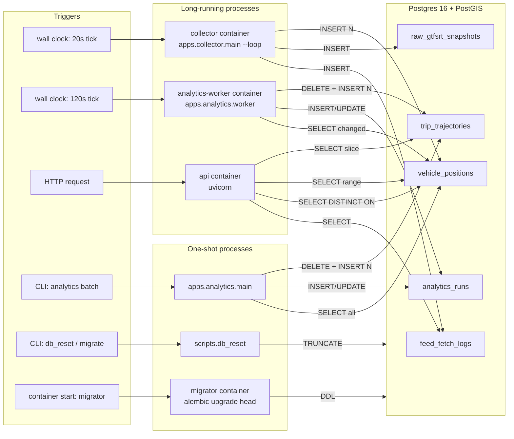
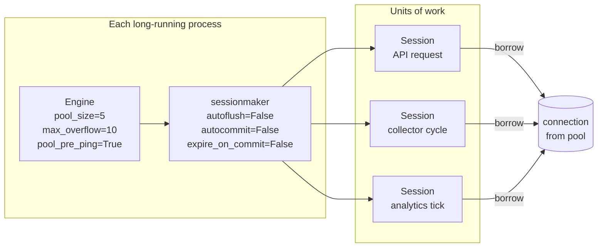
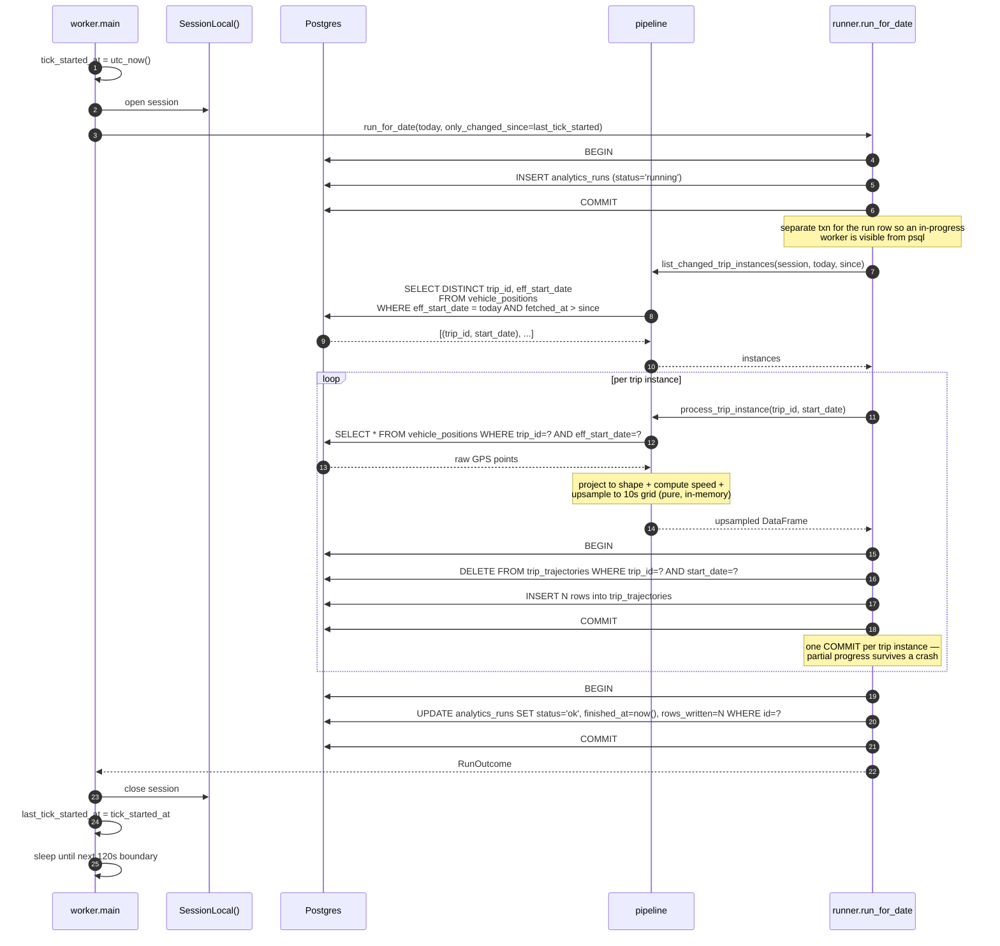
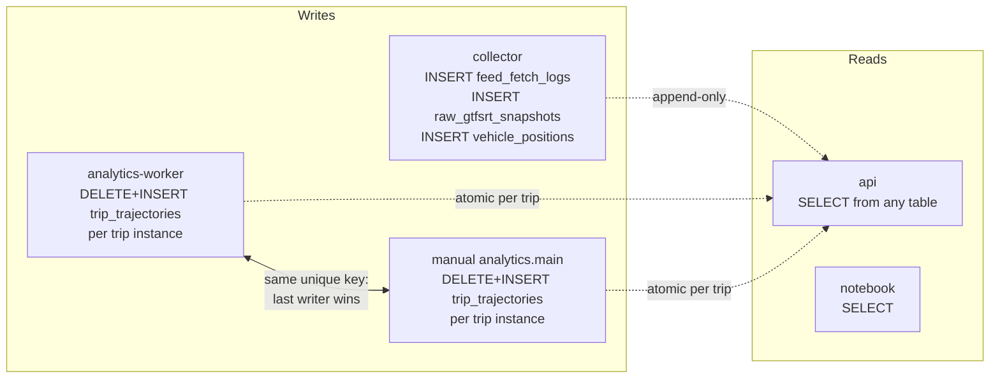
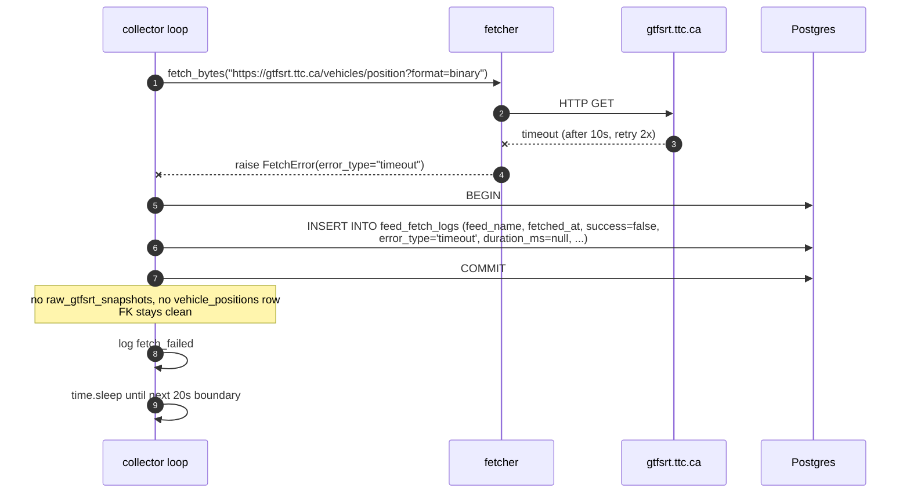
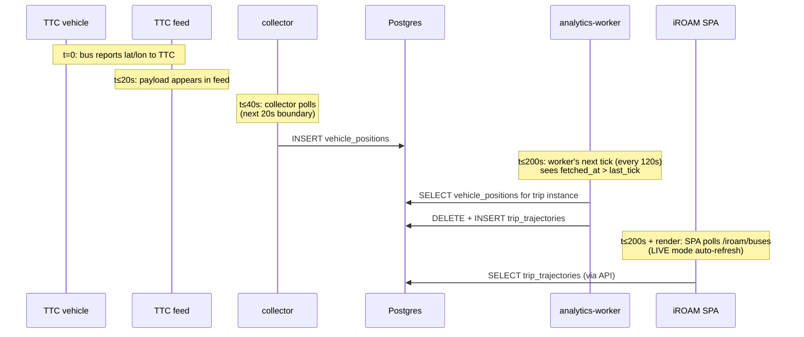

# Database dataflow

Postgres is the **only persistent store** in iROAM. Every piece of state — normalized telemetry, derived trajectories, every fetch attempt — lives in one of five tables. This page traces *every* read and write: which process owns it, what triggers it, what SQL it runs, which index serves it, and how concurrent writers stay out of each other's way.

For the schema itself see [Data model](data-model.html). For the architecture context see [Architecture](architecture.html).

## TL;DR — all paths in one diagram



## The cast

| Where | What it touches | Role | Lives in |
| --- | --- | --- | --- |
| `apps/collector/main.py` (`--loop`) | writer | persists every fetch attempt + a snapshot metadata row + normalized rows | `collector` container |
| `apps/analytics/worker.py` | reader + writer | reads `vehicle_positions`, refreshes `trip_trajectories` for changed trip instances | `analytics-worker` container |
| `apps/analytics/main.py` | reader + writer | one-shot batch — same writes as worker, scoped to a date | `make analytics-run` |
| `apps/api/main.py` (FastAPI) | reader only | every endpoint goes through `db/queries/*.py` | `api` container |
| `db/migrations/versions/*.py` (Alembic) | DDL | schema-only; never writes data rows | `migrator` container, one-shot |
| `scripts/db_reset.py` | TRUNCATE | wipes data, preserves schema | `make db-reset-confirm` |
| `scripts/run_migrations.py` | DDL | programmatic alternative to the CLI | `make migrate` |
| `notebooks/database_access.ipynb` | reader | ad-hoc SQL from the host | host Python kernel |
| `tests/` | both | fixture-driven; uses `TEST_DATABASE_URL` | `make test` |

**Streamlit dashboard and iROAM SPA do not touch the database** — both go through the API. This is a deliberate architectural seam (see [Architecture > Key engineering decisions](architecture.html#key-engineering-decisions)).

## Connection topology

One engine per process, configured in `db/session.py`:



Key knobs (`db/session.py:25-31`):

- **`pool_size=5, max_overflow=10`** — up to 15 connections per process. With 3 long-running services (api, collector, analytics-worker) the upper bound is 45 connections, well under Postgres's default `max_connections=100`.
- **`pool_pre_ping=True`** — sends a cheap `SELECT 1` before handing a connection to a session. Costs ~1 ms but auto-recovers stale connections after a Postgres restart, so the API doesn't have to be restarted alongside the DB.
- **`expire_on_commit=False`** — committed ORM objects keep their attributes accessible without a follow-up `SELECT`. This is what lets `runner.run_once` return `RunOutcome(fetch_log_id=log.id, ...)` immediately after `session.commit()` without an extra round-trip. (One small caveat in the failure paths — see [the bug list](architecture.html) if curious.)
- **`autoflush=False, autocommit=False`** — transaction boundaries are explicit, never implicit. The collector and analytics runners are the *only* code that calls `session.commit()`.

Session lifecycle:

- **API**: a fresh session per HTTP request via the `get_db` dependency in `apps/api/deps.py:15-20`. Closed when the response is sent.
- **Collector**: a fresh session per polling cycle via `with SessionLocal() as session` in `apps/collector/main.py:49-54`. One transaction per session.
- **Analytics worker**: a fresh session per tick via `with SessionLocal() as session` in `apps/analytics/worker.py:46-56`. Multiple commits *within* the tick — one per trip instance refresh.
- **Batch analytics**: same as worker.

## Trigger taxonomy

Every DB interaction is triggered by exactly one of these:

| Trigger | Cadence | Process | Reads / writes |
| --- | --- | --- | --- |
| Wall-clock 20 s tick | continuous | `collector` | writes `feed_fetch_logs` (+raw +VP on success) |
| Wall-clock 120 s tick | continuous | `analytics-worker` | reads `vehicle_positions`, writes `analytics_runs` + `trip_trajectories` |
| HTTP request | per request | `api` | reads only — `feed_fetch_logs`, `vehicle_positions`, `trip_trajectories` |
| `make up` / `make migrate` | manual | `migrator` | DDL (Alembic) |
| `make analytics-run DATE=…` | manual | `apps.analytics.main` | same writes as worker, full date refresh |
| `make db-reset-confirm` | manual | `scripts.db_reset` | TRUNCATEs data tables |
| Jupyter cell / `psql` | manual | host process | ad-hoc reads |

Two intervals — `COLLECTOR_INTERVAL_SECONDS` and `ANALYTICS_WORKER_INTERVAL_SECONDS` — are the entire automated trigger surface. Everything else needs a human or an HTTP client.

## Write paths

### 1. Collector cycle

Source: `apps/collector/main.py` + `apps/collector/runner.py`.

```mermaid
sequenceDiagram
    autonumber
    participant Loop as main.py loop
    participant Sess as SessionLocal()
    participant Fetch as fetcher
    participant Parse as parser
    participant Norm as normalize_vehicles
    participant DB as Postgres

    Loop->>Loop: time.sleep until next 20s boundary
    Loop->>Sess: open session
    Loop->>Fetch: fetch_bytes(url)
    alt HTTP / timeout failure
        Fetch--xLoop: raise FetchError
        Loop->>DB: BEGIN
        Loop->>DB: INSERT feed_fetch_logs (success=false)
        Loop->>DB: COMMIT
    else success
        Fetch-->>Loop: bytes
        Loop->>Parse: parse_feed_message(bytes)
        alt parse failure
            Parse--xLoop: raise ParseError
            Loop->>DB: BEGIN
            Loop->>DB: INSERT feed_fetch_logs (success=false)
            Loop->>DB: COMMIT
        else parsed
            Parse-->>Loop: FeedMessage
            Loop->>Norm: normalize_vehicle_positions(msg)
            Norm-->>Loop: list[VehiclePosition]
            Loop->>DB: BEGIN
            Loop->>DB: INSERT feed_fetch_logs
            Loop->>DB: flush (assign log.id)
            Loop->>DB: INSERT raw_gtfsrt_snapshots (fetch_log_id=log.id)
            Loop->>DB: flush (assign snapshot.id)
            Loop->>DB: INSERT N rows into vehicle_positions (snapshot_id=snapshot.id)
            Loop->>DB: COMMIT
        end
    end
    Loop->>Sess: close session
```

**Tables written:** `feed_fetch_logs`, `raw_gtfsrt_snapshots`, `vehicle_positions`.

**Transaction boundary:** exactly one `COMMIT` per cycle. Failures still commit a row (so the failure is observable on the `/feed-status` endpoint) — they just commit just the log row, not the snapshot or vehicle rows.

**Volume:** with `COLLECTOR_INTERVAL_SECONDS=20` and ~1500 active TTC vehicles, the steady state is **3 polls/min × 1500 rows ≈ 4500 vehicle_positions rows/min** (≈ 6.5M/day after the route allowlist drops most of the network). Since migration `0005` dropped the raw payload, `raw_gtfsrt_snapshots` rows are tiny metadata records (<300 B each), as are fetch-log rows (<200 B each) — `vehicle_positions` is now the dominant on-disk cost.

**Idempotency:** none. Every cycle is a new observation. There is no `ON CONFLICT` clause — duplicate snapshots are explicitly allowed because two byte-identical polls are still distinct observations (the "feed reachable but stuck" signal lives here).

### 2. Analytics worker tick

Source: `apps/analytics/worker.py` + `apps/analytics/runner.py` + `apps/analytics/pipeline.py`.



**Tables read:** `vehicle_positions` (twice — once for the changed-instance list, once per trip for the points).

**Tables written:** `analytics_runs` (once at start, once at end), `trip_trajectories` (one DELETE + N INSERTs per changed trip instance).

**Transaction boundary:** explicit per-trip-instance commit. A worker crash mid-tick leaves earlier trips' trajectories committed; the next tick will reprocess them only if `vehicle_positions` got new rows in between.

**Idempotency:** strong. The schema-level unique index `(trip_id, start_date, datetime)` on `trip_trajectories` enforces the delete-then-insert contract. A manual `make analytics-run` overlapping with the worker is safe — last writer wins per trip instance, no duplicates possible.

**Cold-start window:** on first tick after a restart, `last_tick_started_at = now - 2*interval` (worker.py:88). So a restart catches up trips active just before boot without reprocessing the whole day.

### 3. Batch analytics — `apps.analytics.main`

Same writes as the worker, but called manually and processes **every** trip instance for the date (no `only_changed_since`). Used for full refresh or CSV export. Coexists safely with the worker via the same unique-index contract.

```bash
make analytics-run DATE=2026-04-20 ROUTE=29
# →
docker compose run --rm api python -m apps.analytics.main --date 2026-04-20 --route 29
```

### 4. Migrator — DDL only

`migrator` container runs `alembic upgrade head` once and exits. Five migrations under `db/migrations/versions/`:

- `0001_initial_schema` — `feed_fetch_logs`, `raw_gtfsrt_snapshots`
- `0002_pivot_to_vehicle_positions` — replaces the legacy `trip_updates` design
- `0003_trip_trajectories` — `analytics_runs` + `trip_trajectories`
- `0004_trip_trajectory_unique` — the unique index that anchors the delete-then-insert contract
- `0005_drop_snapshot_payload` — drops `raw_gtfsrt_snapshots.payload`; raw protobuf bytes are no longer persisted

`make migrate` reruns it; `0004` guards against pre-existing duplicates and refuses to apply if found — `make db-reset-confirm` clears that up.

### 5. Destructive reset — `scripts.db_reset`

`scripts/db_reset.py` issues `TRUNCATE feed_fetch_logs, raw_gtfsrt_snapshots, vehicle_positions, analytics_runs, trip_trajectories CASCADE` inside a single transaction. Dry-run mode prints row counts only; `--yes-i-am-sure` actually executes. The Alembic version table is untouched, so the schema stays migrated.

## Read paths

Every read is a SELECT through one of the query helpers in `db/queries/`. The API never builds SQL inline.

### `feed_fetch_logs`

| Endpoint | Query function | SQL pattern | Index |
| --- | --- | --- | --- |
| `GET /feed-status/vehicle-positions` | `db/queries/feed_stats.feed_status` | aggregate over `WHERE fetched_at >= now() - 1h` | `(feed_name, fetched_at)` |
| `GET /feed-status/vehicle-positions` | `db/queries/feed_stats.recent_fetches` | `ORDER BY fetched_at DESC LIMIT N` | same |

### `vehicle_positions` (the hottest table)

| Endpoint | Query function | SQL pattern | Index that serves it |
| --- | --- | --- | --- |
| `GET /vehicles/latest` | `latest_vehicle_positions` | `SELECT DISTINCT ON (vehicle_id) ... ORDER BY vehicle_id, fetched_at DESC` bounded by `fetched_at >= now() - 24h` | `(vehicle_id, fetched_at DESC)` |
| `GET /vehicles/{id}/latest` | `latest_vehicle_position` | `... WHERE vehicle_id=? ORDER BY fetched_at DESC LIMIT 1` | `(vehicle_id, fetched_at DESC)` |
| `GET /vehicles/{id}/history` | `vehicle_history` | range scan on `fetched_at`, `WHERE vehicle_id=?` | `(vehicle_id, fetched_at DESC)` |
| `GET /routes` | `active_route_ids` | `GROUP BY route_id WHERE fetched_at >= now() - 15min` | `(route_id, fetched_at DESC)` |
| `GET /routes/{id}/vehicles/latest` | `latest_vehicle_positions(route_id=...)` | same as above, scoped | `(route_id, fetched_at DESC)` |
| `GET /routes/{id}/metrics` | `route_metrics` | `DISTINCT ON (vehicle_id)` + aggregate over the result | `(route_id, fetched_at DESC)` |
| `GET /replay/vehicles?start=&end=` | `replay_vehicles` | range scan over `(fetched_at)`, ASC order | `(fetched_at)` via composite |
| analytics: `list_changed_trip_instances` | (called by worker) | `SELECT DISTINCT trip_id WHERE eff_start_date=? AND fetched_at > since` | `(trip_id, fetched_at DESC)` |
| analytics: `fetch_by_trip_instance` | (called by worker/batch) | `SELECT * WHERE trip_id=? AND eff_start_date=?` ORDER BY ts | `(trip_id, fetched_at DESC)` |

The whole "latest is a query, not a mutation" doctrine rests on these composite indexes. `DISTINCT ON` in Postgres uses the leading index without a sort, so the latency stays bounded as the table grows.

### `trip_trajectories`

| Endpoint | Query function | SQL pattern | Index |
| --- | --- | --- | --- |
| `GET /trajectories/service-dates` | `list_service_dates` | `SELECT DISTINCT service_date ORDER BY DESC` | `ix_tt_route_service_dt` |
| `GET /trajectories/trips` | `list_trip_instances` | filter by `(service_date, route_id)`, group by `trip_id` | `ix_tt_route_service_dt` |
| `GET /trajectories/trips/{id}` | `fetch_trip_trajectory` | `WHERE trip_id=? AND start_date=?` ORDER BY datetime | `ux_trip_trajectories_instance_dt` |
| `GET /iroam/routes` | `list_route_catalog` | DISTINCT (route_id, direction_id, service_date) | `ix_tt_route_service_dt` |
| `GET /iroam/buses`, `/iroam/analytics`, `/iroam/forecast` | `fetch_trajectories_for_slice` | `WHERE route_id=? AND service_date=? AND direction_id=?` ORDER BY trip_id, start_date, vehicle_id, datetime | `ix_tt_route_service_dt` |

The iROAM SPA fires the last three on every slider change, so `(route_id, service_date, direction_id)` is the most-trafficked composite key in the system after `(vehicle_id, fetched_at DESC)`. The Streamlit dashboard's Trajectories page reads the same data, but via the API.

### `raw_gtfsrt_snapshots` and `analytics_runs`

These two are **write-only** in normal operation. Nothing in `db/queries/*.py` or the API reads them. They exist for:

- `raw_gtfsrt_snapshots` — the FK link target for `vehicle_positions.snapshot_id` and a record of each fetch's content hash (`content_sha256`). Since migration `0005` it no longer stores raw bytes; re-normalization works from `vehicle_positions.raw_entity`.
- `analytics_runs` — observability. Look it up with `psql` to ask "did today's analytics ever finish, and how many rows did it write?".

## Concurrency model

Three long-running writers/readers run simultaneously inside docker-compose. They never block each other in any operationally meaningful way:



The three guarantees that make this work:

1. **Collector inserts are append-only.** `vehicle_positions` rows have monotonic `fetched_at` and a unique `id`; no UPDATE, no DELETE. The collector and the worker can interleave freely on this table: the worker's `WHERE fetched_at > since` scoping reads a snapshot of "everything committed before my SELECT" without ever conflicting with the collector's next INSERT.
2. **Analytics writes are atomic per trip instance.** `DELETE WHERE (trip_id, start_date) = ?` then `INSERT N` happen in one transaction, gated by the unique index `ux_trip_trajectories_instance_dt`. If two writers race on the same trip instance, one of them gets a unique-violation rollback and retries — and the other's version is the surviving one. In practice the worker holds a row-range lock for the duration of the delete+insert (a few ms), so the manual batch usually just waits its turn.
3. **API is read-only.** No locks needed, no blocking. PostgreSQL's MVCC means readers see a consistent snapshot as of statement start, regardless of in-flight writers.

What this **does not** guarantee: that an analytics-worker tick sees every collector-committed row up to the moment the tick started. The cutoff for "changed since" is the *previous* tick's `tick_started_at` (analytics-worker:88). A vehicle_positions row committed at `tick_started_at + 1ms` is seen by the *next* tick, not the current one. That's fine — the next tick is 120 s away.

## End-to-end traces

Three named scenarios, end to end.

### A. "User opens the iROAM SPA at 18:00 and pulls up Route 29 for today"

```mermaid
sequenceDiagram
    autonumber
    participant U as User browser
    participant SPA as iroam.html (React)
    participant API as FastAPI
    participant Q as db/queries
    participant DB as Postgres

    U->>SPA: visit /ui
    SPA->>API: GET /iroam/routes
    API->>Q: list_route_catalog(session)
    Q->>DB: SELECT DISTINCT route_id, direction_id, service_date, trip_id, start_date<br/>FROM trip_trajectories
    DB-->>Q: rows
    Q-->>API: catalog
    API-->>SPA: [{route_id:29, direction_id:0, dates:[...], ...}, ...]
    U->>SPA: pick route 29, direction NB, date today
    SPA->>API: GET /iroam/stops?route_id=29&direction_id=0
    Note over API: in-memory: compute_route_stops projects<br/>static GTFS onto canonical shape (no DB)
    API-->>SPA: stops
    SPA->>API: GET /iroam/buses?route_id=29&service_date=2026-04-20&direction_id=0&...
    API->>Q: fetch_trajectories_for_slice(session, ...)
    Q->>DB: SELECT * FROM trip_trajectories<br/>WHERE route_id=29 AND service_date='2026-04-20' AND direction_id=0<br/>ORDER BY trip_id, start_date, vehicle_id, datetime
    DB-->>Q: ~10-30k rows for a busy route
    Q-->>API: list[TripTrajectory]
    Note over API: group → BusTrajectory list; run detect_all<br/>(idle / bunch / crowd); no DB
    API-->>SPA: { buses: [...], totals: {...} }
    SPA->>U: render time-distance diagram
    U->>SPA: click "Run forecast"
    SPA->>API: GET /iroam/forecast?...
    API->>Q: fetch_trajectories_for_slice(...) — same SQL again
    Q->>DB: same SELECT
    DB-->>Q: same rows
    Q-->>API: list[TripTrajectory]
    Note over API: build feature windows,<br/>30 LightGBM boosters
    API-->>SPA: { per_bus: [...], horizon_summary: {...} }
```

**Tables hit:** `trip_trajectories` only (three times for one rendered slice). Static GTFS is read from `Complete GTFS/*.txt` mounted at `/gtfs` — never the database. The bunching predictor loads from `deployment/bunching_lightgbm/model/` — never the database.

### B. "Collector polls the TTC feed and a network error occurs"



**Observable effect downstream:** the next `GET /feed-status/vehicle-positions` returns a lower `success_rate_1h` and the most recent `recent_fetches` entry has `success=false, error_type='timeout'`. The Streamlit "Feed Health" page picks this up; the iROAM SPA is unaffected (it doesn't query feed health).

### C. "A vehicle reports a position, and 4 minutes later it shows up on the SPA"

The full pipeline trace, condensed.



**End-to-end latency:** worst case ≈ `COLLECTOR_INTERVAL_SECONDS + ANALYTICS_WORKER_INTERVAL_SECONDS + SPA refresh interval ≈ 20 + 120 + a few seconds`. So ~2.5 min from "bus reports position" to "bus appears on the time-distance diagram." This is *the* latency knob: shorten either interval, fresher data, more DB load.

## Failure modes worth knowing about

- **Postgres restart.** `pool_pre_ping=True` papers over it — sessions get a fresh connection, no app restart needed. Any in-flight transaction at the moment of restart sees `OperationalError` once, then recovers.
- **Migrator fails on `make up`.** The `api`, `collector`, and `analytics-worker` containers all have `depends_on: migrator: condition: service_completed_successfully`, so they refuse to start. Fix the migration, `make up` again.
- **Collector crashes mid-transaction.** Sync SQLAlchemy + `with SessionLocal()` rolls back automatically. No half-written rows. Next cycle starts clean.
- **Worker crashes mid-tick.** Earlier trip instances' commits survive. On restart, the cold-start cutoff (`now - 2 * interval`) means missed trips get reprocessed on the very next tick.
- **Disk fills up.** Postgres throws `disk full`. Collector logs the error, fetches stop being persisted, feed-fetch-log entries also fail. The `/health` endpoint will still return `200` (DB ping succeeds against the metadata catalog), so the operator has to watch logs, not health. Mitigation lives in [Operations > Reset and re-ingest](operations.html#reset-and-re-ingest).
- **Unique-index conflict on `trip_trajectories`.** Means the delete-then-insert contract was violated — almost certainly a bug. The runner re-raises and `analytics_runs.status='failed'` records it for forensics. Concurrent worker+batch on the same trip cannot trigger this because the DELETE precedes the INSERT in the same transaction.
