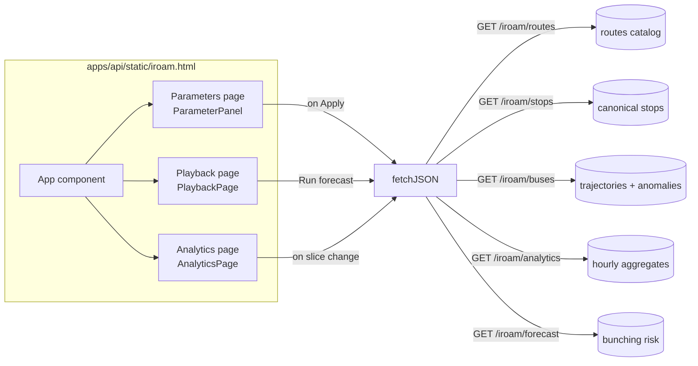

# Frontend

iROAM ships **two** user interfaces. They share the FastAPI backend and never read the database directly.

| Surface | Audience | Tech | Served at |
| --- | --- | --- | --- |
| **iROAM SPA** | Operators / researchers analyzing route behaviour | Single-file React + Babel-standalone | `GET /ui` (FastAPI static mount) |
| **Streamlit dashboard** | Engineers debugging feed and pipeline health | Streamlit multipage app | <http://localhost:8501> |

## iROAM single-page app — `apps/api/static/iroam.html`

The flagship UI. ~1950 lines of JSX in one file, transpiled in-browser by Babel-standalone, no build step. Mounted by `apps/api/main.create_app` and served at `/ui`.

### Three pages

The top-level `<App>` component switches between three pages from a sidebar:

- **Parameters**. Pick route, service date, direction, anomaly thresholds (`bunch_sec`, `idle_min`, `crowd_pct`, `bunch_dist`, `bunch_method`). Drives every subsequent fetch. `ParameterPanel` reads the route catalog from `GET /iroam/routes` and the stop list from `GET /iroam/stops`.
- **Playback**. Time-distance diagram with animated buses; LIVE mode auto-refreshes against the current time. Replay speed control (0.5×, 1×, 2×, 4×). A "Run forecast" button calls `GET /iroam/forecast` and overlays per-bus risk bars + a horizon probability curve. The chart drag-resizes; pulldown stop list highlights the chosen subset.
- **Analytics**. Hour-by-hour summaries from `GET /iroam/analytics`: bus count, anomaly counts (bunch / idle / crowd), occupancy mix, per-type breakdowns. Resizable grid.

### Module-level state

The file mutates a handful of module-scoped vars in addition to React state, deliberately, so JSX components re-render whenever a "slice" (route × date × direction) changes:

| Var | Set by | Read by |
| --- | --- | --- |
| `ROUTE29_STOPS`, `STOPS`, `NUM_STOPS` | `applyStopsAndWindow` after `GET /iroam/stops` | `PlaybackPage`, `AnalyticsPage` |
| `LAT_MIN/MAX`, `LON_MIN/MAX` | `applyStopsAndWindow` | schematic route map |
| `START_T`, `END_T` | `applyStopsAndWindow` from `/iroam/buses` time-window | time-axis ticks |
| `ROUTE_META` | static (in source) | dropdowns, direction labels |

### API contract

Every endpoint the SPA hits is in `apps/api/routers/iroam.py`. See [API reference](api.html#apps-api) for signatures.

- `GET /iroam/routes` → `[{route_id, direction_id, available_dates}]`
- `GET /iroam/stops?route_id&direction_id` → `{stops: [{name, lat, lon, stop_index}]}`
- `GET /iroam/buses?route_id&service_date&direction_id&bunch_sec&idle_min&crowd_pct&bunch_dist&bunch_method` → `{buses: [{trip_id, points, anomalies}], time_window: [start_min, end_min], totals}`
- `GET /iroam/analytics?route_id&service_date&direction_id&...` → hourly aggregates
- `GET /iroam/forecast?route_id&service_date&direction_id&t_ref` → `{per_bus, horizon_summary, ...}` (see [Architecture > Forecast](architecture.html#layer-6-forecast-lightgbm-bunching-predictor))

### Runtime dependencies

The SPA loads three scripts from CDNs in `<head>`:

- `react@18.3.1/umd/react.development.js`
- `react-dom@18.3.1/umd/react-dom.development.js`
- `@babel/standalone@7.29.0/babel.min.js`

This keeps the artifact a single static file with no build pipeline. The Babel-standalone bundle compiles the JSX at page-load. The tradeoff: viewing the SPA needs a network connection on first load (then the browser caches React + Babel). For a production deployment, swap to a pre-built bundle.

Font: `IBM Plex Sans` + `IBM Plex Mono` from Google Fonts.

### Where to edit

| You want to… | Edit |
| --- | --- |
| Add a route or change direction labels | `ROUTE_META` literal near top of `iroam.html` |
| Change a slider's min/max/step | `<Slider>` props inside `ParameterPanel` |
| Wire a new endpoint | Add a `fetchJSON('/iroam/whatever')` call; new module-scope var; consumer in `<App>` or a page component |
| Change colours / theme | CSS custom properties in the `<style>` block near `:root` |
| Adjust forecast adapter | `adaptForecast()` function, around the AnalyticsPage section |

The file uses ASCII section banners (`// ───`) between major components: data, helpers, icons, primitives, sidebar, top bar, parameter panel, playback page, forecast adapter, analytics page, toasts/utilities, App.

## Streamlit dashboard — `apps/dashboard/`

A more engineering-focused UI. Six pages, all backed by `apps/dashboard/api_client.py` (never the DB directly):

1. **Home** — system health summary (active vehicles, success rate).
2. **Feed Health** — fetch attempt log and per-minute success/failure chart.
3. **Live Fleet Map** — real-time map of every active vehicle.
4. **Route Explorer** — pick a route, see active trips and anomalies.
5. **Vehicle Detail** — single-vehicle 24 h trail and charts.
6. **Replay** — time-window replay on a map.
7. **Trajectories** — drill into upsampled trajectories from the analytics worker.

The dashboard is at <http://localhost:8501> when docker-compose is running. See the [`apps/dashboard` module page](modules/apps-dashboard.html) for per-file details.

## When to use which

| Task | Use |
| --- | --- |
| Inspect anomalies on a specific route/date/direction | iROAM SPA → Playback |
| Forecast bunching for the running fleet | iROAM SPA → Playback → Run forecast |
| Hour-by-hour anomaly statistics | iROAM SPA → Analytics |
| Diagnose collector failure | Streamlit → Feed Health |
| See every vehicle currently reporting | Streamlit → Live Fleet Map |
| Stare at one bus's last 24 hours | Streamlit → Vehicle Detail |
| Replay a historical time window on a map | Streamlit → Replay |
