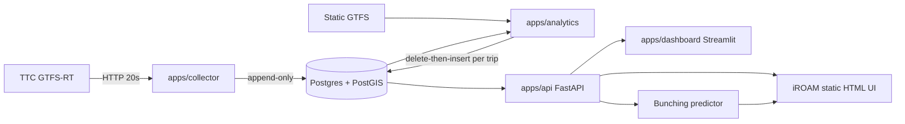

# iROAM

**Integrated Route Operation and Anomaly Monitor** — a route-centric transit-operations platform that ingests live GTFS-Realtime vehicle telemetry, reconstructs per-trip trajectories against static GTFS, surfaces operational anomalies (bunching, idling, crowding), and forecasts short-horizon bunching risk.

Implemented around the Toronto Transit Commission `VehiclePositions` feed. Production-structured but research-focused.

## 10-minute tour

1. **[Architecture](architecture.html)** — five layers (acquisition → storage → analytics → API → UI/forecast) with diagrams.
2. **[Data model](data-model.html)** — five tables, append-only ingestion, refresh-by-trip-instance for derived products, plus the static GTFS inputs.
3. **[Database dataflow](database-dataflow.html)** — every read and write traced end-to-end: triggers, transactions, indexes, concurrency.
4. **[Frontend](frontend.html)** — the iROAM SPA served at `/ui` and the Streamlit dashboard.
5. **[Operations](operations.html)** — Makefile, docker-compose services, env vars, tests.
6. **[Modules](modules/apps-collector.html)** — one page per package, every public function and class.
7. **[API reference](api.html)** — global index of all extracted signatures and docstrings.
8. **[Examples](examples.html)** — quickstart, curl recipes, forecast call.

## At a glance

## What is this site

A static, offline doc site for the iROAM codebase. Generated by `python docs/_build/render.py` from:
- module docstrings and signatures, extracted with `ast`
- hand-authored prose under `docs/_build/content/`
- Mermaid diagrams compiled in-browser

No server, no build step at view time. Open `docs/index.html` directly in any browser.

## Who this is for

Transit-research collaborators with Python literacy who have **not** read the source. After this site, a reader should be able to:

- Sketch the data flow from `https://gtfsrt.ttc.ca/vehicles/position` to a forecast on the dashboard.
- Find any module's purpose and public API in under a minute (use the sidebar search).
- Re-run the analytics pipeline against a custom service date.

## Codebase facts

- **Language**: Python ≥ 3.10. Type-annotated throughout with `from __future__ import annotations`.
- **Frameworks**: FastAPI (API), Streamlit (dashboard), SQLAlchemy 2.x + Alembic (DB), pandas + shapely + pyproj (analytics), LightGBM (forecaster).
- **Database**: PostgreSQL 16 + PostGIS, all timestamps `TIMESTAMPTZ` (UTC).
- **Scale**: ~89 Python files, ~178 public functions and classes, 4 Alembic migrations, 5 tables.
- **Runtime**: three long-running processes (collector, API, analytics-worker) plus Postgres and the Streamlit dashboard, orchestrated by `docker-compose`.
