# iROAM: Integrated Route Operation and Anomaly Monitor

## 1. Introduction

iROAM is a route-centric transit operations intelligence platform for monitoring, reconstructing, and forecasting bus service behaviour from GTFS-Realtime vehicle telemetry. In this repository, the system is implemented around the Toronto Transit Commission (TTC) `VehiclePositions` feed and combines five major capabilities in one coherent stack: continuous realtime data ingestion, append-only operational storage, GTFS-aware trajectory reconstruction, anomaly analytics, and short-horizon bus bunching forecasting. Rather than treating realtime AVL data as a transient stream for visualization only, iROAM preserves a normalized relational representation of every observation (including each entity's decoded payload JSON), then derives a higher-level analytical layer that supports playback, route diagnosis, and predictive monitoring.

From an academic perspective, iROAM can be viewed as a multi-layer spatiotemporal decision-support system for public transport operations. Its design addresses three research and engineering problems simultaneously:

1. How to build a reliable application-layer architecture that continuously acquires and stores high-frequency transit telemetry without losing provenance.
2. How to transform noisy point-based AVL observations into route-aligned, temporally regularized trajectories that are suitable for downstream analytics.
3. How to surface both descriptive and predictive service-quality signals, including bunching, idling, crowding, and future bunching risk, in a route-level operational dashboard.

The repository shows that iROAM is not a single dashboard page or a standalone model. It is a layered system in which ingestion, storage, analytics, API serving, and interactive visualization are deliberately separated, yet connected through stable data contracts.

## 2. System Scope and Design Objective

The implemented system takes TTC GTFS-Realtime `VehiclePositions` as the canonical live source, joins it with static GTFS schedule and shape data, and exposes the fused results through both machine-readable APIs and human-facing dashboards. The design target is not merely “latest vehicle locations,” but an operational representation of route behaviour over time. This shift from snapshot monitoring to route-operation analytics is the core idea behind iROAM.

Operationally, the system answers four classes of questions:

- **State monitoring:** Which vehicles are active now, on which routes, and with what freshness and service condition?
- **Trajectory reconstruction:** How did a given trip instance evolve along its route in time-distance space?
- **Anomaly diagnosis:** Where and when did bunching, long idling, or severe crowding occur?
- **Short-term forecasting:** Which currently running buses are at risk of bunching in the next few minutes?

These questions are answered through a pipeline that starts with raw protobuf bytes and ends with route-day-direction slices that can be replayed, analyzed, and forecast.

## 3. Application-Layer Structure Design

The repository implements iROAM as a layered application rather than a monolith. The codebase is organized into `apps/`, `core/`, `db/`, and `deployment/`, with each major runtime concern encapsulated behind clear module seams.

At a repository level, the main implementation units map cleanly onto architectural responsibilities:

| Repository area | Architectural role |
| --- | --- |
| `apps/collector/` | GTFS-Realtime acquisition, parsing, and normalization |
| `db/models/`, `db/queries/`, `db/migrations/` | persistence model, query layer, schema evolution |
| `apps/analytics/` | GTFS-aware trajectory reconstruction and anomaly inputs |
| `apps/api/` | route, fleet, trajectory, and iROAM service interfaces |
| `apps/dashboard/` | general operational dashboard for live and historical views |
| `deployment/bunching_lightgbm/` | deployable predictive model bundle and retraining script |
| `tests/` | behavioural specification for parser, analytics, API, and forecast logic |

### 3.1 Layer 1: Data Acquisition Layer

The acquisition layer is implemented in `apps/collector/`. Its responsibilities are:

- pulling GTFS-Realtime bytes from the TTC endpoint at a fixed interval;
- handling HTTP failure, timeout, and retry behaviour;
- parsing protobuf payloads, with fallback from binary wire format to protobuf text format;
- normalizing each `FeedEntity.vehicle` into detached ORM rows;
- writing fetch metadata and normalized rows into the database.

Two design choices are especially important here.

First, the collector is **feed-agnostic** at the runner level. `FeedSpec` objects define how a feed is named, where it is fetched from, and which pure normalizer converts it into database rows. This is a small but strong architectural decision: collector control flow is stable even if additional GTFS-Realtime feeds are added later.

Second, the collector preserves **provenance alongside normalized data**. Every successful fetch writes:

- a `feed_fetch_logs` record for observability,
- a `raw_gtfsrt_snapshots` record carrying the fetch's content hash and header metadata,
- one or more normalized `vehicle_positions` rows, each retaining its decoded per-entity JSON in `raw_entity`.

This design supports reproducibility, future parser upgrades, and replay/debug workflows: a parser change can be re-applied against the preserved `raw_entity` JSON without re-fetching the live feed.

### 3.2 Layer 2: Persistent Storage Layer

The storage layer is implemented with PostgreSQL, PostGIS, SQLAlchemy 2.x, and Alembic migrations. The live schema revolves around four core entities:

- `feed_fetch_logs`: every collection attempt, whether successful or failed;
- `raw_gtfsrt_snapshots`: one metadata record (content hash, header info) per successful fetch;
- `vehicle_positions`: normalized realtime AVL rows;
- `analytics_runs` and `trip_trajectories`: derived trajectory analytics output.

The storage model combines two policies:

- **append-only ingestion** for operational provenance,
- **refresh-by-trip-instance** for derived trajectory products.

The append-only policy is fundamental. “Latest” state is not stored by overwriting old rows; it is reconstructed through indexed queries such as `DISTINCT ON (vehicle_id)` ordered by descending `fetched_at`. This gives iROAM a complete observation history while keeping current-state APIs cheap.

The raw snapshot table also preserves one row per fetch instead of deduplicating identical content hashes. In operational terms, two fetches with the same `content_sha256` at different times are distinct observations because they reveal feed liveness and temporal persistence. (The raw protobuf bytes themselves are no longer stored — migration `0005` dropped the `payload` column once it proved to be the dominant on-disk cost without a consuming read path; re-normalization works from the decoded `raw_entity` JSON on `vehicle_positions`.)

The use of PostGIS is pragmatic rather than ornamental. `vehicle_positions` includes a generated `geom(Point, 4326)` column with a GiST index so that the system can retain spatial extensibility even though most current analytics are route-aligned rather than free-form spatial joins.

### 3.3 Layer 3: Analytics and Reconstruction Layer

The analytics layer is implemented in `apps/analytics/`. This is where pointwise AVL observations become route-consistent trajectories. The pipeline is intentionally organized around pure transformations on pandas DataFrames, while `runner.py` remains the only transaction owner. This mirrors the collector’s architectural pattern: side-effect-free data transforms plus a narrow persistence boundary.

This layer performs the following operations:

1. load static GTFS tables (`trips`, `stops`, `stop_times`, `shapes`, `routes`);
2. identify active trip instances for a service date;
3. extract chronologically ordered observations for each `(trip_id, start_date)` pair;
4. attach static attributes such as `shape_id` and `direction_id`;
5. project GPS points onto a GTFS shape in metric space;
6. remove off-route outliers by orthogonal distance thresholding;
7. derive moving speed from distance-time differences;
8. upsample trajectories onto a fixed temporal grid;
9. persist the cleaned per-point trajectory output.

The output of this layer, `trip_trajectories`, is the analytical backbone of iROAM. The iROAM dashboard and the `/iroam/*` API do not query raw `vehicle_positions` directly for route playback; they consume the reconstructed trajectory layer instead.

### 3.4 Layer 4: Service and API Layer

The service layer is implemented in `apps/api/` with FastAPI. It exposes:

- live fleet APIs (`/vehicles`, `/routes`, `/feed-status`, `/replay`);
- trajectory APIs (`/trajectories`);
- iROAM route analytics APIs (`/iroam/routes`, `/iroam/stops`, `/iroam/buses`, `/iroam/analytics`, `/iroam/forecast`).

The iROAM API slice is especially important because it acts as a stable contract between analytics computation and the frontend. Each endpoint serves a route-day-direction slice and is parameterized by anomaly thresholds such as bunching headway, bunching separation distance, idle duration, and crowding occupancy. This means the frontend does not implement the analytics logic itself; it acts as an interactive client over a deterministic backend.

### 3.5 Layer 5: Presentation Layer

Two presentation surfaces coexist in the repository:

- a Streamlit operational dashboard in `apps/dashboard/`, focused on general platform monitoring;
- a static React-style iROAM interface served from `apps/api/static/iroam.html`, focused on route playback, visual analytics, and forecasting.

The iROAM interface is organized around three user tasks:

- **parameter configuration** for route, date, direction, and anomaly thresholds;
- **playback** via a time-distance diagram coupled to a schematic route view;
- **analytics** through stop-level and hourly summaries, plus running-time allocation views.

The forecast panel is integrated into the playback page and uses the same route slice already materialized for anomaly analysis. This is a strong application-layer decision because it prevents the predictive module from drifting into a disconnected demo; forecasting is contextualized inside the same operational scene being inspected.

### 3.6 Layer 6: Predictive Modeling Layer

The predictive layer is implemented in `deployment/bunching_lightgbm/`. It packages a deployable LightGBM-based bunching predictor as a self-contained artifact bundle:

- 30 per-horizon booster files,
- a feature scaler,
- per-horizon decision thresholds,
- model metadata.

The API loads this model lazily through a singleton service so that forecasting incurs model startup cost only on first use. This keeps the operational API lightweight when prediction is not requested, while still allowing low-latency inference during interactive use.

## 4. Framework Design

The framework design reflects a bias toward reliability, explicit transaction boundaries, and low-complexity deployment.

### 4.1 Python-Centric Backend Stack

iROAM uses Python across ingestion, analytics, API serving, and dashboarding. This unifies the runtime and simplifies data handoff across subsystems. The main libraries correspond closely to each problem domain:

- **FastAPI** for typed HTTP services,
- **SQLAlchemy 2.x** for explicit ORM/data-access structure,
- **Alembic** for schema versioning,
- **pandas** for trajectory-oriented tabular transforms,
- **shapely** and **pyproj** for geometric projection,
- **LightGBM** and **NumPy** for predictive modeling,
- **Streamlit** for rapid operational visualization.

### 4.2 Synchronous Database and Collector Design

The system intentionally uses synchronous SQLAlchemy sessions. Given the polling interval and moderate operational query load, the repository treats explicit and simple transaction ownership as more valuable than introducing asynchronous database complexity. This is visible in both the collector and analytics runner implementations.

### 4.3 Containerized Multi-Process Deployment

`docker-compose.yml` shows the runtime decomposition:

- `postgres`,
- `migrator`,
- `collector`,
- `analytics-worker`,
- `api`,
- `dashboard`.

This is an important framework-level decision. Instead of embedding collection, analytics refresh, and API serving into one long-running process, the repository separates them into independently restartable services. That improves fault isolation and aligns with pipeline semantics: ingestion and analytics are recurring jobs, whereas the API is read-serving.

## 5. End-to-End Data Pipeline

The iROAM data pipeline has two interconnected flows: a **live operational pipeline** and a **predictive feature pipeline**.

### 5.1 Live Operational Pipeline

The live pipeline proceeds as follows:

1. The collector fetches TTC GTFS-Realtime `VehiclePositions` every configured interval.
2. The payload is parsed and normalized into `vehicle_positions`, retaining each entity's decoded JSON in `raw_entity`.
3. Fetch metadata and a content hash are recorded in `raw_gtfsrt_snapshots`.
4. The analytics worker periodically identifies trip instances that gained new observations since the previous tick.
5. Each changed trip instance is reprocessed into a refreshed `trip_trajectories` representation.
6. The API serves route-level playback and analytics from `trip_trajectories`.
7. The frontend renders route playback, anomaly overlays, and summary charts from the API response.

This design is incremental. The analytics worker does not rebuild the entire day on every tick; it computes the set of changed trip instances and refreshes them atomically through delete-then-insert semantics guarded by a unique index on `(trip_id, start_date, datetime)`.

### 5.2 Predictive Pipeline

The predictive branch begins from the iROAM slice already assembled for playback. At a reference time `t_ref`, the forecasting service:

1. identifies buses that are currently “running” and eligible;
2. constructs a 60-step by 9-channel feature window per eligible bus;
3. batches these windows through the LightGBM model bundle;
4. returns per-bus probabilities and aggregate horizon summaries.

This feature pipeline is deliberately route-aware. It does not forecast from arbitrary single-vehicle history alone; it also uses relative spacing to upstream vehicles, which is essential for bunching prediction.

## 6. Key Algorithms and Analytical Methods

### 6.1 Effective Trip-Instance Identification

The TTC feed often omits `TripDescriptor.start_date`. To preserve the trip-instance concept, the analytics pipeline synthesizes an effective `start_date` from Toronto-local `vehicle_timestamp` or `fetched_at` when necessary. This is an important operational adaptation because `trip_id` alone is not a unique trip instance key across service days.

Relatedly, the trajectory extractor parses GTFS `start_time` values that can exceed 24 hours, such as `27:15:00`, into absolute datetimes. This is necessary for overnight trips and allows the system to compute a meaningful `time_offset_seconds` feature relative to scheduled trip start.

### 6.2 GPS-to-Shape Projection

Each GPS point is projected onto a GTFS `shape_id` polyline that has already been transformed into EPSG:3857 meter coordinates. For each observation:

- `travel_distance_m` is computed as the distance along the route shape from its origin to the closest projected point;
- `orthogonal_distance_m` is computed as the perpendicular deviation from the observed point to the nearest point on the shape.

Points farther than the configured orthogonal threshold are removed. Algorithmically, this turns raw GPS observations into one-dimensional route-progress measurements, which are substantially more suitable for service analytics than latitude-longitude alone.

### 6.3 Moving-Speed Estimation

Moving speed is estimated by finite differencing:

\[
v_i = \frac{d_i - d_{i-1}}{t_i - t_{i-1}}
\]

where \(d_i\) is route-aligned travel distance and \(t_i\) is observation time. This speed is attached to the arriving row and later used by the upsampling stage.

### 6.4 Fixed-Grid Trajectory Upsampling

The trajectory upsampler inserts synthetic points at fixed epoch-aligned boundaries, by default every 10 seconds. Distance at each inserted boundary is estimated using the next row’s speed:

\[
\hat{d}(t_c) = d_{current} + (t_c - t_{current}) \cdot v_{next}
\]

Identity attributes are copied from the nearer of the current or next real observation using a midpoint rule in route-distance space. This algorithm is inherited from the project’s legacy pipeline and is explicitly protected by parity-style tests so that temporal alignment does not drift during refactoring.

The effect of this step is crucial: it converts irregular realtime polling into a regularized trajectory tensor that is directly usable for analytics, plotting, and machine learning.

### 6.5 Stop-Index Mapping

Before stop-index mapping, iROAM chooses a **canonical trip and shape** for each `(route_id, direction_id)` pair. The implemented rule selects the most common `shape_id`, with ties broken by the trip having the largest number of `stop_times`. This avoids short-turn variants becoming the route reference geometry by accident.

For the iROAM interface, every projected point is converted from route distance into a fractional stop index by binary searching the ordered stop-distance list of the canonical route shape. This provides a stable y-axis for the time-distance diagram: buses are visualized relative to ordered stops rather than raw metric distance.

### 6.6 Anomaly Detection

Three anomaly families are implemented.

**Bus idling:** a contiguous run of samples with speed below a small threshold is flagged if its duration exceeds a configurable minimum.

**Crowding:** GTFS-Realtime occupancy states are mapped to coarse occupancy percentages, and contiguous runs above a threshold are flagged as crowding events.

This crowding logic should be interpreted carefully in academic terms: the feed supplies ordinal occupancy categories rather than true passenger counts or load factors. iROAM therefore treats crowding as a rule-based proxy signal, not a direct APC-derived measurement.

**Bus bunching:** two detectors are supported.

- **Time-based bunching:** two consecutive buses are considered bunched if they cross the same stop within a headway threshold.
- **Distance-based bunching:** two consecutive buses are considered bunched if their along-route separation stays below a spatial threshold over a contiguous interval.

The system can run either detector or both simultaneously, and bunching events are tagged by method so that the frontend can separate them analytically.

### 6.7 Ghost-Trajectory Trimming and Vehicle-Trip Segmentation

The repository includes a subtle but important correction for stale feed behaviour. Vehicles may continue broadcasting the same `trip_id` long after a physical run has ended, producing long near-zero-speed tails. iROAM segments trajectories at long stale runs and discards ghost segments with negligible displacement. It also keys bus grouping on `(trip_id, start_date, vehicle_id)` rather than only `(trip_id, start_date)` to avoid merging physically distinct vehicles that reuse the same scheduled trip identifier. These behaviours are test-driven and materially affect visualization correctness.

### 6.8 Feature Engineering for Forecasting

The bunching forecast uses a rolling window of shape `(60, 9)`, corresponding to 60 temporal ticks and 9 channels:

- target bus speed, forward gap, auxiliary feature;
- first upstream bus speed, gap, auxiliary feature;
- second upstream bus speed, gap, auxiliary feature.

Eligibility rules enforce operational realism: the bus must be fresh, away from route termini, have enough recent history, and have at least some upstream-bus context.

### 6.9 Per-Horizon LightGBM Forecasting

The deployed model is a set of 30 independent gradient-boosted tree classifiers, one for each forecast horizon. Training converts future forward-gap values into binary bunching labels relative to a 100 m threshold, tunes class weighting by horizon, and selects operating thresholds using validation-set \(F_2\) optimization. At runtime, the API returns:

- per-horizon probabilities,
- threshold-based alert decisions,
- first alert horizon,
- maximum risk horizon,
- aggregate alert-rate and mean-probability curves.

This is a pragmatic forecasting design: it avoids recurrent model state in deployment, keeps inference CPU-friendly, and preserves horizon-specific interpretability.

## 7. Key Feature Design

The major user-facing features in iROAM correspond directly to the underlying architecture.

### 7.1 Route-Day-Direction Slice as the Core Interaction Unit

Instead of forcing the user to navigate per vehicle first, iROAM organizes the analytics experience around a route, a service date, and a direction. This is the natural unit for service control because bunching, crowding, and route-level reliability are collective phenomena.

### 7.2 Coupled Time-Distance and Spatial Playback

The playback interface combines a time-distance diagram with a schematic route map. This paired representation supports both temporal reasoning and route-location reasoning. Since the backend already transforms data into stop-index space, the frontend can animate buses consistently across the route.

### 7.3 Parameterized Anomaly Reprocessing

Anomaly thresholds are not hard-coded in the interface. The backend accepts threshold parameters and recomputes event summaries for the selected slice. This supports operational what-if analysis and makes iROAM closer to an analytical instrument than a fixed report.

### 7.4 Embedded Forecasting

Forecasting is not isolated on a separate model page. It is called from the playback view at a meaningful reference time and returns results in the same operational context. This is a strong feature-design decision because it ties prediction to current route state and immediately visible evidence.

## 8. Data Assets

Three data sources are visible in the repository.

1. **GTFS-Realtime VehiclePositions** from TTC, used for live ingestion.
2. **Static GTFS files** under `Complete GTFS/`, used for shapes, stops, trips, and stop sequences.
3. **Chronological training windows** external to this repository but referenced by the LightGBM deployment metadata, used to train the bunching model.

The first two sources drive the live iROAM system directly. The third supports the predictive model bundle and shows that the forecasting component is grounded in a separate supervised learning pipeline.

## 9. Validation and Reliability

The repository includes a meaningful test suite around the most failure-prone semantics of the platform. These tests are not decorative; they specify the intended behaviour of the analytical system.

- parser and normalizer tests verify protobuf decoding and field mapping;
- analytics tests verify GTFS loading, trip extraction, shape projection, speed derivation, and upsampling;
- iROAM-specific tests verify bus grouping, stale-tail trimming, and bunching detection;
- forecast tests verify feature-window construction, eligibility logic, API shape, and bundled model loading.

From a research-software perspective, this matters because iROAM’s correctness depends on behavioural details such as temporal alignment, segmentation, and route-progress reconstruction. The tests make those details explicit and reproducible.

## 10. Highlights and Contributions

Several aspects of the repository stand out as system-level contributions.

- **Provenance-preserving architecture:** every fetch is logged, hashed, and retained as a normalized row with its decoded per-entity JSON, supporting re-normalization without re-fetching.
- **Route-aware analytical abstraction:** raw AVL points are transformed into route-progress trajectories rather than used directly.
- **Incremental refresh semantics:** only changed trip instances are reprocessed, which is appropriate for operational deployments.
- **Hybrid descriptive and predictive analytics:** anomaly detection and forecasting coexist over the same route slice.
- **Tested behavioural semantics:** grouping, projection, upsampling, anomaly detection, and forecasting rules are all pinned by targeted tests.
- **Clear separation of concerns:** collector, analytics, API, dashboard, and model bundle are decoupled but interoperable.

## 11. Conclusion

In this repository, iROAM is best understood as an end-to-end transit operations analytics framework rather than only a visualization interface. Its architecture begins with robust realtime feed acquisition, preserves observation provenance in an append-only database, reconstructs route-aligned trajectories through GTFS-informed geometric processing, detects operational anomalies with explicit algorithms, and adds a deployable machine-learning layer for short-horizon bunching risk. The resulting system is academically interesting because it unifies data engineering, geospatial analytics, service operations monitoring, and predictive modeling within one coherent application-layer design.

The most important technical idea in iROAM is the creation of an intermediate analytical representation: the route-aligned, time-regularized trip trajectory. That representation is the bridge between raw AVL telemetry and higher-level operational intelligence. It is what makes the system capable of supporting route playback, anomaly summarization, and forecasting in a consistent and extensible way.

## 12. Working Pipeline Flow Chart

The following flow chart summarizes the implemented iROAM working pipeline from realtime ingestion to analytics and forecasting.

```mermaid
flowchart TD
    A[TTC GTFS-Realtime VehiclePositions Feed] --> B[Collector<br/>apps/collector]
    B --> B1[HTTP Fetch + Retry]
    B1 --> B2[Protobuf Parse<br/>binary with text fallback]
    B2 --> B3[Vehicle Normalization]

    B3 --> C1[feed_fetch_logs]
    B3 --> C2[raw_gtfsrt_snapshots<br/>fetch metadata + content hash]
    B3 --> C3[vehicle_positions<br/>normalized AVL rows]

    D[Static GTFS Bundle<br/>Complete GTFS] --> D1[trips / stops / stop_times / shapes]

    C3 --> E[Analytics Worker<br/>apps/analytics/worker]
    D1 --> E
    E --> E1[List changed trip instances<br/>trip_id + effective start_date]
    E1 --> E2[Trajectory Extraction]
    E2 --> E3[Shape Projection<br/>travel_distance_m]
    E3 --> E4[Outlier Filtering<br/>orthogonal distance threshold]
    E4 --> E5[Moving Speed Estimation]
    E5 --> E6[10-second Upsampling]
    E6 --> E7[Trip-Trajectory Refresh<br/>delete then insert]
    E7 --> F[trip_trajectories]
    E --> F1[analytics_runs]

    D1 --> G[Route Stop Projection<br/>canonical shape + stop distances]
    F --> H[FastAPI Service Layer<br/>apps/api]
    G --> H

    H --> H1[/vehicles /routes /feed-status /replay]
    H --> H2[/trajectories]
    H --> H3[/iroam/buses]
    H --> H4[/iroam/analytics]
    H --> H5[/iroam/forecast]

    H3 --> I1[Bus Grouping + Stale Segment Trimming]
    I1 --> I2[Anomaly Detection<br/>bunching / idling / crowding]
    I2 --> J[iROAM Frontend<br/>time-distance playback + analytics]
    H4 --> J

    F --> K[Forecast Feature Builder<br/>60 x 9 windows]
    H5 --> K
    K --> L[LightGBM Bunching Predictor<br/>deployment/bunching_lightgbm]
    L --> M[Per-bus risk + horizon summary]
    M --> J
```

## 13. Key Algorithms and Analytical Methods Usage Diagram

The following diagram locates the major algorithms and analytical methods within the implemented iROAM architecture, showing where each method is applied and what artifact or interface it supports.

```mermaid
flowchart LR
    subgraph S1[Realtime Ingestion and Persistence]
        A1[GTFS-Realtime Parsing<br/>binary with text fallback<br/>apps/collector/parser.py]
        A2[Vehicle Entity Normalization<br/>field extraction + enum mapping<br/>apps/collector/normalize_vehicles.py]
        A3[Append-only Persistence Logic<br/>fetch log + raw snapshot + normalized rows<br/>apps/collector/runner.py]
    end

    subgraph S2[Trajectory Reconstruction]
        B1[Effective Trip-Instance Identification<br/>coalesced start_date logic<br/>apps/analytics/pipeline.py]
        B2[GTFS Overnight Time Parsing<br/>27:15:00 style handling<br/>apps/analytics/trajectory_extract.py]
        B3[Canonical Shape Selection<br/>most common shape_id + longest stop pattern<br/>apps/analytics/stop_projection.py]
        B4[GPS-to-Shape Projection<br/>travel_distance_m + orthogonal_distance_m<br/>apps/analytics/project_to_shape.py]
        B5[Moving-Speed Estimation<br/>distance and time differencing<br/>apps/analytics/upsample.py]
        B6[Fixed-Grid Temporal Upsampling<br/>10-second boundary interpolation<br/>apps/analytics/upsample.py]
        B7[Incremental Refresh Semantics<br/>delete then insert per trip instance<br/>apps/analytics/runner.py]
    end

    subgraph S3[Route Analytics for iROAM]
        C1[Stop-Index Mapping<br/>distance to fractional stop index<br/>apps/analytics/stop_projection.py]
        C2[Vehicle-Trip Segmentation<br/>vehicle_id-aware grouping + stale-tail trimming<br/>apps/api/routers/iroam.py]
        C3[Idle Detection<br/>low-speed duration threshold<br/>apps/analytics/anomalies.py]
        C4[Crowding Detection<br/>occupancy-state to percent proxy<br/>apps/analytics/anomalies.py]
        C5[Time-based Bunching Detection<br/>same-stop crossing headway rule<br/>apps/analytics/anomalies.py]
        C6[Distance-based Bunching Detection<br/>along-route separation rule<br/>apps/analytics/anomalies.py]
    end

    subgraph S4[Forecasting Layer]
        D1[Forecast Eligibility Screening<br/>freshness edge exclusion history checks<br/>apps/api/services/forecast_features.py]
        D2[Feature Window Construction<br/>60 x 9 target and upstream bus tensor<br/>apps/api/services/forecast_features.py]
        D3[Per-Horizon LightGBM Inference<br/>30 independent horizon classifiers<br/>deployment/bunching_lightgbm/src/predict.py]
        D4[Threshold-based Alert Aggregation<br/>first alert max risk horizon summary<br/>apps/api/services/forecast.py]
    end

    A1 --> A2 --> A3
    A3 --> B1
    B1 --> B2 --> B4
    B3 --> B4
    B4 --> B5 --> B6 --> B7

    B6 --> C1
    B7 --> C2
    C1 --> C2
    C2 --> C3
    C2 --> C4
    C2 --> C5
    C2 --> C6

    B7 --> D1
    C1 --> D1
    D1 --> D2 --> D3 --> D4

    A3 -.supports provenance and replay.-> P1[(feed_fetch_logs<br/>raw_gtfsrt_snapshots<br/>vehicle_positions)]
    B7 -.produces.-> P2[(trip_trajectories<br/>analytics_runs)]
    C3 -.feeds.-> P3[iROAM Analytics API]
    C4 -.feeds.-> P3
    C5 -.feeds.-> P3
    C6 -.feeds.-> P3
    D4 -.feeds.-> P4[iROAM Forecast API]
```


